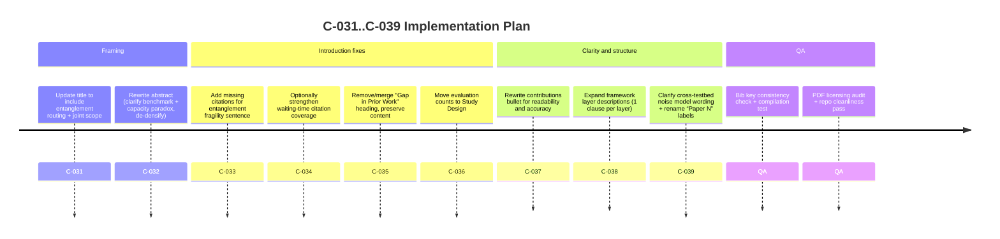

# C-031 to C-039 Deep Review for QuantumFaultTolerant Paper

## Executive Summary

Across C-031 through C-039, your proposed direction is strong: it aligns the paper’s framing with what the manuscript actually does (joint entanglement routing + qubit allocation, evaluated under a structured threat taxonomy), and it improves readability by moving “accounting” details (counts) out of the Introduction and by making key scaffolding (framework layers, cross-testbed noise models) explicit. The two main risks to manage are (i) **title/abstract over-claiming novelty** (readers may infer a brand-new routing algorithm rather than a benchmark + hybrid variants + systematic evaluation), and (ii) **cross-testbed ambiguity** caused by internal “Paper N” naming that does not match the project’s separate testbed documentation conventions.

Concrete high-impact fixes:

- **Title** should explicitly include **entanglement routing** and **joint** routing/allocation, but ideally also signals **benchmarking** to avoid misrepresenting the contribution as solely new-algorithm work.
- **Abstract** should reduce numeric density and fix ambiguous referents (“They”), while explicitly stating (a) this is a **systematic benchmark**, (b) you evaluate **multiple bandit families**, and (c) you identify the **capacity paradox** as a central empirical finding. The current abstract is very dense and uses “They” without a clear antecedent. fileciteturn17file0L226-L228
- **Intro citations**: the “fragile / probabilistic / decoherence” sentence needs citations; right now it is a factual claim without support. fileciteturn17file0L302-L304
- **“Gap in Prior Work” heading** can be removed or downgraded to an inline bold lead-in to improve narrative flow while keeping the content.
- **Evaluation counts** (“7,890…” etc.) should move to Study Design; they derail the story in the Intro.
- **Contributions bullet** should be rewritten to avoid being a citation dump and to emphasize *matched threats, consistent semantics, and direct comparability*.
- **Framework layer descriptions** should add one clause per layer (what it does, what it passes to the next layer) because the current list is too skeletal relative to how central the framework is to your claim.
- **Cross-testbed section** already has meaningful detail, but your *contributions bullet* and *cross-testbed intro text* should define “noise models” more concretely and avoid internal class-name verbosity where it distracts.

Finally, your repo’s tracker currently **does not yet include C-031..C-039** (it ends around C-030 in the visible queue), so you should add these items to the tracker to keep review/merge discipline consistent. fileciteturn17file1L28-L55

## Information Needs and Sources Consulted

### Information needs (3–6) required to answer well

- **Exact current Title + Abstract + Intro text** in `main.tex` (to ensure edits match what’s actually written). fileciteturn17file0L163-L168 fileciteturn17file0L226-L228 fileciteturn17file0L302-L306
- **Whether C-031..C-039 exist in the tracker**, and if not, whether you need to add them now to preserve workflow traceability. fileciteturn17file1L28-L55
- **Whether BibTeX keys exist** for the citations you plan to add/fix (e.g., `liu2024qbgp`, `clayton2024quarc`, `chaudhary2023quantum`, and EXP3 citations). fileciteturn24file0L33-L38 fileciteturn24file0L147-L161 fileciteturn24file0L106-L112
- **Cross-testbed naming consistency** (your paper uses “Paper 2/7/12” externally; internal framework docs also use “Paper2” in a different sense). fileciteturn24file2L20-L31 fileciteturn24file1L29-L36
- **PDF availability / licensing risk** for `references/pdfs` (especially if any PDFs are publisher paywalled vs. arXiv open copies). This needs a follow-up check because the directory listing could not be reliably enumerated via the available connector methods.

### Sources consulted (repo + drive)

- GitHub repo **pzg8794/QuantumFaultTolerant**:
  - `main.tex` (title, abstract, introduction; plus later sections for concrete edit targets). fileciteturn17file0L163-L168 fileciteturn17file0L226-L228 fileciteturn17file0L302-L306
  - `docs/tracking/PAPER-CHANGES-TRACKER.md` (current queue; confirms C-031..C-039 not yet present). fileciteturn17file1L28-L55
  - `refs.bib` (cross-testbed keys + EXP3 key presence). fileciteturn24file0L33-L38 fileciteturn24file0L147-L161 fileciteturn24file0L106-L112
- GitHub repo **pzg8794/quantum_project** (for testbed naming/cross-testbed ambiguity check):
  - `docs/Paper2_Integration_Report.md` (internal “Paper2” meaning and assumptions). fileciteturn24file1L29-L36
  - `setup_files/TESTBEDS.md` (framework testbed hub; shows internal numbering conventions differ from paper’s external “Paper N” usage). fileciteturn24file2L20-L31
- Google Drive shared folder `1AvScTeYb_xr4rpIe3FSlaSAuGkTTKEbU` was accessible and contains a compiled `main.pdf` and logs; it was used only as a sanity check of availability, not as the primary source of text.

## C-031 to C-039 Task Review and Paste-Ready LaTeX Edits

Below, each task includes (a) focused evaluation and (b) a **paste-ready snippet**.

### C-031 — Title: Include “Entanglement Routing” (and avoid misrepresentation)

**What’s in the paper now:**
The title currently foregrounds “Qubit Allocation” and “Stochastic Bandits,” but the paper repeatedly frames the problem as **joint path selection + allocation** under multiple threat regimes. fileciteturn17file0L163-L168

**Why the change makes sense:**
Your own keywords already include “entanglement routing.” fileciteturn17file0L232-L234
So the title should match that scope.

**Best practice recommendation:**
Use a title that includes:
- **Entanglement routing** (what domain readers search)
- **Joint routing + allocation** (true task)
- Ideally signals **benchmarking/evaluation** (so it doesn’t read like a single new method paper)

**Paste-ready edit (replace the current `\title{...}` line):**
```latex
% C-031 (Title)
% Replace the current title line with one of the recommended titles (see title section below).
\title{Benchmarking Bandit Algorithms for Entanglement Routing and Qubit Allocation under Stochastic and Adversarial Threats}
```

Also remove the highlight marker `\hl{...}` for submission hygiene (right now the title is highlighted). fileciteturn17file0L163-L164

### C-032 — Abstract: Clarity (contribution type), numeric density, ambiguous referents

**What’s in the paper now:**
The abstract is very dense, mixing configuration counts, model counts, performance ranges, and cross-testbed ranges; it also uses “They” with a weak antecedent. fileciteturn17file0L226-L228

**What it should do instead (target behavior):**
- **Sentence 1–2:** problem + why hard (uncertainty + adversary)
- **Sentence 3:** contribution type: *systematic benchmark* + *hybrid pursuit–neural variants*
- **Sentence 4–5:** distilled key empirical findings (capacity paradox + allocator interaction)
- **Final sentence:** cross-testbed validation + what it reveals (scale/physics dependence)

**Paste-ready replacement abstract (replace everything between `\begin{abstract}` and `\end{abstract}`):**
```latex
% C-032 (Abstract rewrite)
\begin{abstract}
Quantum entanglement routing must repeatedly choose paths and allocate scarce qubits while link quality evolves under stochastic noise and potentially adaptive disruption. We present a unified evaluation framework for \emph{joint} path selection and qubit allocation, benchmarking adversarial, contextual, and pursuit--neural hybrid bandit policies under a five-scenario threat taxonomy. Across a large configuration sweep, pursuit--neural hybrids consistently define the robustness frontier, achieving near-Oracle efficiency under benign and stochastic regimes while retaining stronger worst-case behavior than non-contextual baselines under reactive threats.

Most critically, we uncover a \emph{capacity paradox}: increasing replay capacity can \emph{reduce} efficiency under Adaptive attacks by amplifying behavioral predictability, indicating that predictability---not raw bandwidth---is a primary vulnerability mechanism in adversarial quantum routing. We further show that allocator choice induces large performance swings for identical learning policies, making allocator--algorithm co-design a deployment requirement. Cross-testbed validation on three external simulators spanning 15--100 nodes confirms that algorithm rankings persist but absolute efficiency is strongly topology- and physics-dependent.
\end{abstract}
```

This version explicitly frames the work as **evaluation + framework**, avoids long enumerations, fixes “They” by naming the subject, and retains the capacity paradox as the central “hook.”

### C-033 — Intro: Add citations for “reliable end-to-end entanglement is difficult…”

**What’s in the paper now:**
This key factual sentence has no citations. fileciteturn17file0L302-L304

**Why the change is necessary:**
It’s a core factual claim; leaving it uncited makes the intro read like opinion.

**Paste-ready edit (add citations to the end of the sentence):**
```latex
% C-033 (Intro citation)
...and performance degrades rapidly under decoherence and interference~\cite{briegel1998quantum,dahlberg2021netsquid,zukowski1993event}.
```

You already cite repeaters and swapping elsewhere in the same region; this ties the fragility claim to foundational sources in your bib.

### C-034 — Intro: Waiting-time citations (add one if you want, or keep as-is)

**What’s in the paper now:**
You cite repeaters and a waiting-time paper; this is already reasonably strong. fileciteturn17file0L302-L303

**Recommendation:**
Keep `wang2019waiting` (it is well-targeted for probabilistic waiting times). If you want one more citation for “compounds along multi-hop routes,” add a multi-hop/route-focused key that you already use elsewhere.

**Paste-ready optional edit (minimal additive citation):**
```latex
% C-034 (Optional extra citation)
...compound along multi-hop routes~\cite{wang2019waiting,li2025multipath}.
```

If you prefer to avoid extra citations, you can leave C-034 unchanged (this is not a correctness bug, only a “support depth” improvement).

### C-035 — Intro structure: Remove/merge “Gap in Prior Work” heading

**What’s in the paper now:**
You have a standalone heading `\subsection{Gap in Prior Work}`. fileciteturn17file0L306-L306

**Why your proposal makes sense:**
It interrupts narrative flow (it reads like a proposal document rather than a paper intro). The content is good; the *heading* is the issue.

**Paste-ready approach (keep content, remove the “speed bump” heading):**
1) Delete (or comment out) the heading line:
```latex
% C-035 (Remove/merge heading)
% \subsection{Gap in Prior Work}
```

2) Replace it with an inline lead-in statement *without changing the content that follows*:
```latex
% C-035 (Inline lead-in replacing the subsection heading)
\noindent\textbf{Gaps in prior evaluations.}
```

This preserves structure while improving flow and keeping the section hierarchy lighter.

### C-036 — Move evaluation counts out of Introduction

**What’s in the paper now (problem):**
The Intro includes explicit “total evaluations” accounting, which is better suited for Study Design.

**Recommended change:**
- Replace the numeric accounting sentence in the Intro with a pointer to Study Design.
- Insert the numeric sentence in Study Design where readers expect “how much did you run?”

**Paste-ready edit (Intro replacement):**
```latex
% C-036 (Intro: replace evaluation counts with a pointer)
We conduct a large-scale evaluation over these settings; the full cross-product breakdown and total run counts are reported in Section~\ref{sec:studydesign}.
```

**Paste-ready edit (Study Design insertion — add near the beginning of `\section{Study Design}`):**
```latex
% C-036 (Study Design: insert the moved evaluation counts)
In total, we report about \textbf{7,890 model--scenario--configuration evaluations} across \textbf{835 unique scenario--allocator--capacity--horizon settings}.
```

### C-037 — Contributions bullet: Rewrite “Unified, reproducible benchmarking…”

**What’s in the paper now:**
The current bullet is accurate but reads like a citation dump and foregrounds taxonomy terms rather than reviewer-facing value. (This is consistent with your observation; the sentence is long and dense.)

**Bib sanity check:**
Your bib includes an EXP3 citation entry (`auer2002exp3`). fileciteturn24file0L106-L112
You also cite INFOCOM’24 QBGP and QuARC keys. fileciteturn24file0L33-L38 fileciteturn24file0L147-L153

**Paste-ready rewrite (replace that bullet only):**
```latex
% C-037 (Contributions bullet rewrite)
\item \textbf{Apples-to-apples benchmarking under matched threats:}
We benchmark adversarial (EXP3-family), contextual (CMAB/iCMAB), and pursuit--neural hybrid policies under a shared threat taxonomy and consistent allocator/capacity semantics, enabling direct comparisons of robustness and efficiency tradeoffs~\cite{auer2002exp3,chu2011contextual,kar2024icmab,huang2025quantum}.
```

If you prefer to standardize on the “nonstochastic” naming, switch `auer2002exp3` to the bib key you use elsewhere in the paper—but do that only if the key is present and you want one canonical reference name.

### C-038 — Framework: Explain the six layers

**What’s in the paper now:**
You list six layers but with minimal explanation. This is a mismatch because the framework is central to your “unified evaluation” claim.

**Paste-ready replacement (replace the 6-item list in `\subsection{Algorithmic Framework}` with this richer version):**
```latex
% C-038 (Framework layers: expanded explanations)
\noindent Our evaluation infrastructure consists of \textbf{six layers} (Figure~\ref{fig:framework}):

\begin{enumerate}
\item \textbf{ALLOCATOR:} Selects the per-path qubit budgets (Fixed, ThompsonSampling, DynamicUCB, Random) that define the resource constraints for each run and threat regime.
\item \textbf{CONFIGURATION:} Encodes the shared experimental conditions (topology, threat scenario, capacity semantics, scale factor, and seeds), ensuring matched comparisons across model families.
\item \textbf{EVALUATOR:} Instantiates the threat process, orchestrates experiments across scenarios and seeds, logs rewards, and tracks the Oracle for normalization.
\item \textbf{RUNNER:} Executes per-scenario/per-seed batches (including replay/capacity settings), applies allocator decisions, and collects per-frame outcomes for aggregation.
\item \textbf{MODEL:} Implements the routing policy (bandit family + optional neural/context components) and outputs path/allocation decisions given the observed context and feedback.
\item \textbf{VISUALIZER:} Aggregates results into efficiency curves, summary tables, and scenario-level winner analyses used throughout the Results and Cross-Testbed sections.
\end{enumerate}

This modular separation supports systematic ablations across allocators, algorithms, and threat regimes under consistent capacity semantics, enabling reproducible comparisons~\cite{wang2025learning,huang2025quantum}.
```

### C-039 — Cross-testbed validation: clarify “noise models/settings” and avoid ambiguous “Paper N” naming

**What’s already good:**
Your cross-testbed section *already* includes concrete parameter examples and topology scale. The main improvement needed is: make the “noise model” phrase more interpretable in one sentence, and reduce ambiguity that comes from “Paper 2/7/12” shorthand.

**Critical ambiguity to address:**
Your separate framework docs use “Paper2” as a label for an internal 4-node stochastic testbed. fileciteturn24file1L31-L36
But the paper’s cross-testbed section uses “Paper 2” for an external 15-node simulator setting. This naming collision increases reviewer confusion and makes it harder to reproduce.

**Paste-ready edits (two small but high-impact changes):**

1) **Update the contribution bullet** so “noise models” are defined and the reader knows where details live:
```latex
% C-039 (Contributions: clarify what “noise models” means + add pointer)
\item \textbf{Cross-testbed validation at multiple scales:}
We validate our algorithms on three external quantum network testbeds from prior work~\cite{chaudhary2023quantum,liu2024qbgp,clayton2024quarc}, spanning 15--100 nodes and heterogeneous physical/control dynamics: (i) explicit gate/memory error channels, (ii) benchmarking-driven path dynamics, and (iii) fusion-based entanglement models (details in \S\ref{sec:testbed_comparison}).
```

2) **Rename “Paper 2/7/12” labels in the cross-testbed section** to author-year tags (keep “Paper N” only as an internal parenthetical if you must):
```latex
% C-039 (Cross-testbed: remove ambiguous “Paper N” shorthand)
\item \textbf{Chaudhary et al. (ICC 2023) testbed}~\cite{chaudhary2023quantum}: ...

\item \textbf{Liu et al. (INFOCOM 2024) QBGP testbed}~\cite{liu2024qbgp}: ...

\item \textbf{Clayton et al. (QuARC, 2024) testbed}~\cite{clayton2024quarc}: ...
```

**Why this is worth doing:**
Your bib already contains these external testbed keys. fileciteturn24file0L33-L38 fileciteturn24file0L147-L161
Renaming reduces cognitive overhead for reviewers and avoids collisions with internal testbed documentation conventions. fileciteturn24file2L20-L31

## Title Recommendations and Comparison Table

### Final title recommendations (2–3) with rationale and pros/cons

1) **Recommended (submission-safe, accurately signals evaluation):**
**Benchmarking Bandit Algorithms for Entanglement Routing and Qubit Allocation under Stochastic and Adversarial Threats**
- **Pros:** Immediately communicates *benchmarking*, *joint routing/allocation*, and the *threat scope*.
- **Cons:** Slightly longer; “benchmarking” may undersell that you also propose/implement pursuit–neural hybrids.

2) **Recommended (shorter, emphasizes methods rather than evaluation):**
**Entanglement Routing and Qubit Allocation in Quantum Networks using Context-Aware Bandits**
- **Pros:** Clear domain match; highlights context-awareness (a core finding).
- **Cons:** Can be read as “we propose one context-aware bandit method,” so you must ensure abstract/intro explicitly state the multi-family benchmark.

3) **Conditional (only if you really want adversarial framing in the title):**
**Benchmarking Contextual and Adversarial Bandits for Entanglement Routing and Qubit Allocation**
- **Pros:** Captures both design philosophies without over-claiming “robust.”
- **Cons:** Less explicit about threat taxonomy; may sound like narrower method comparison.

### Title comparison table (3 user-proposed + 2 alternates)

| Title | Length (words) | Emphasis | Risk of misrepresenting contribution | Recommended for submission? |
|---|---:|---|---|---|
| Qubit Allocation in a Quantum Network using Stochastic Bandits | 9 | Allocation + stochastic bandits | **Medium–High** (understates entanglement routing + adversarial scope) | No |
| Entanglement Routing and Qubit Allocation in Quantum Networks using Context-Aware Bandits | 12 | Joint routing/allocation + contextual learning | **Medium** (can imply single-method paper unless abstract clarifies “benchmark”) | Yes |
| Joint Entanglement Routing and Qubit Allocation via Adversarial-Robust Bandits | 10 | Robustness framing | **High** (“adversarial-robust” can read like a new robust method claim) | No (unless reworded) |
| Benchmarking Bandit Algorithms for Entanglement Routing and Qubit Allocation under Stochastic and Adversarial Threats | 13 | Benchmarking + full threat scope | **Low** (matches what the paper does) | Yes |
| Benchmarking Contextual and Adversarial Bandits for Entanglement Routing and Qubit Allocation | 11 | Direct family comparison | **Low–Medium** (slightly less explicit about threat taxonomy) | Yes |

## Follow-ups and Implementation Timeline

### Short checklist of follow-ups (bib, PDFs, consistency)

- **Add C-031..C-039 rows into `docs/tracking/PAPER-CHANGES-TRACKER.md`** so the tracker matches the current work plan; the visible queue currently ends earlier. fileciteturn17file1L28-L55
- **Submission hygiene:** remove `\hl{...}` highlighting in the title and any remaining author-comment macros for the submission branch. fileciteturn17file0L163-L164
- **Citation key consistency:** decide whether you will cite EXP3 via `auer2002exp3` everywhere or standardize on a single canonical key name; the bib includes an EXP3 entry. fileciteturn24file0L106-L112
- **Cross-testbed naming:** rename “Paper 2/7/12” labels to author-year in the manuscript to avoid collision with internal testbed numbering in the framework docs. fileciteturn24file1L31-L36 fileciteturn24file2L20-L31
- **PDF licensing audit:** if any PDFs in `references/pdfs` originate from paywalled publisher portals (IEEE/ACM/Springer), confirm you are allowed to redistribute them in a (possibly public) GitHub repo; if not, replace with arXiv/preprint links and keep only metadata.
- **Cross-testbed “noise model” correctness check:** verify each external testbed summary sentence against the actual source PDFs (especially if any parameters were extracted from code rather than the paper text).

### Mermaid timeline for implementation steps



